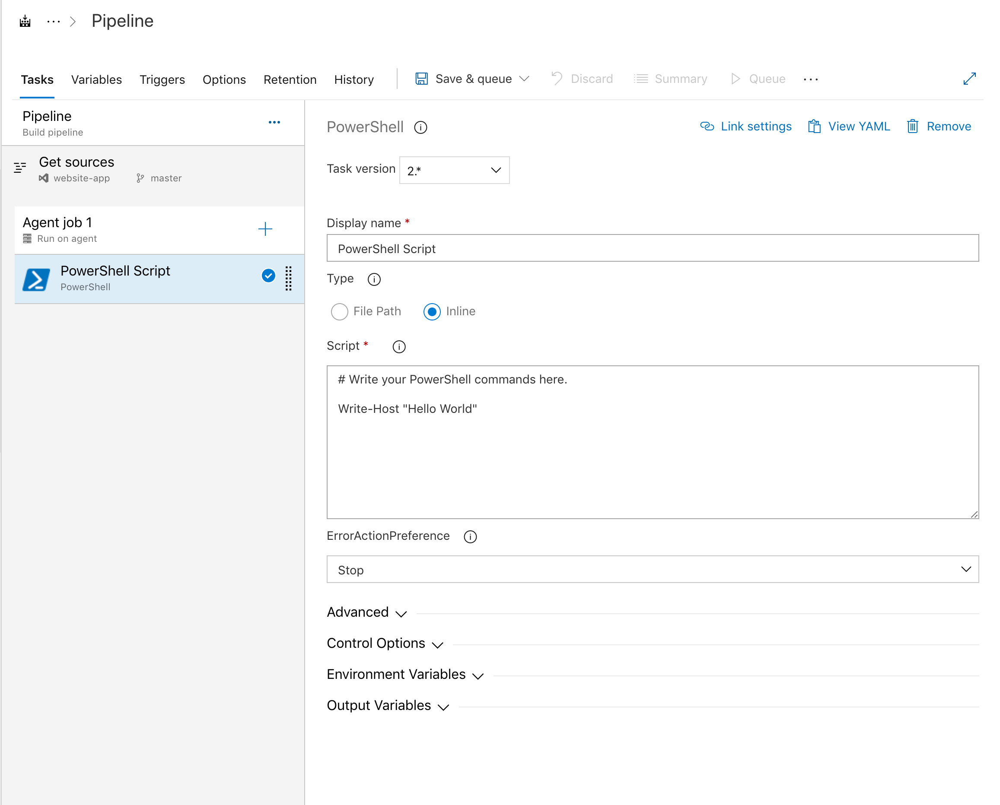
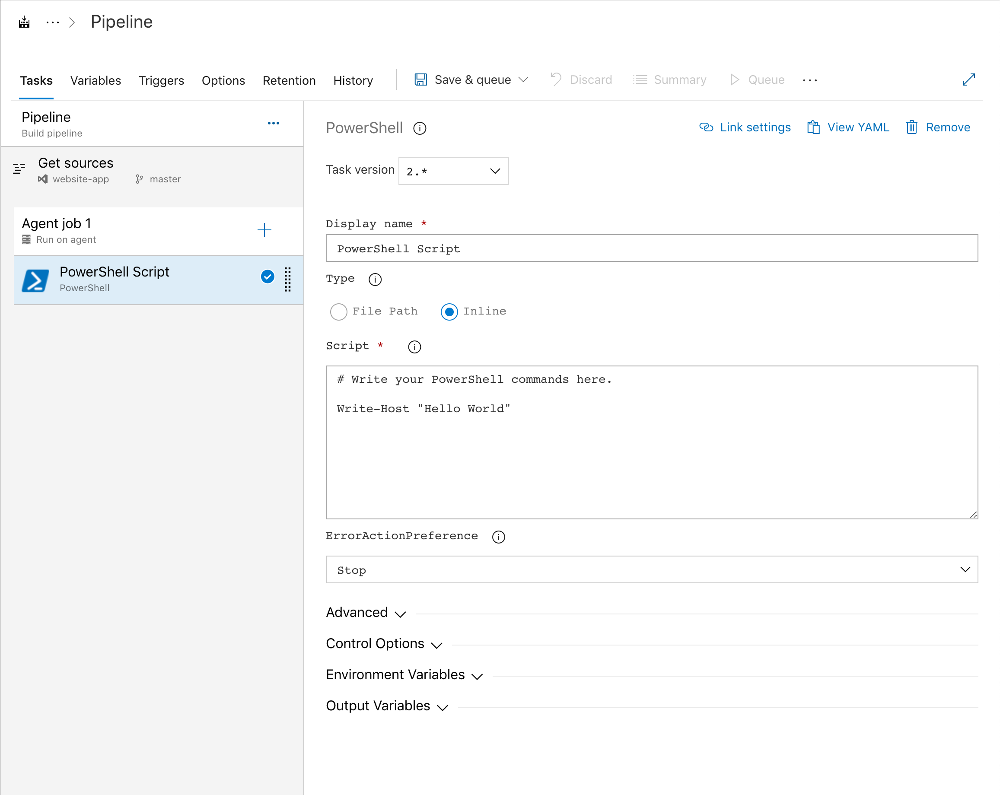

# Azure DevOps Monospaced Font Chrome Extension

Changes the font for input fields in Azure DevOps to monospaced. Useful for writing inline code and distinuishing similar characters.

## Examples

### Before

### After

## Installation

* Go to `chrome://extentions`
* Enable 'Developer mode' using the top right switch
* Click 'Load unpacked'
* Select the directory containing this code

## Usage

When you want to monospace fonts simple click the extension icon in Chrome.

## Notes

This was a quick hacky extension that has no testing done to it. It might not work in your version of Chrome or may not work with Azure DevOps in the future. Feel free to take the few bits that are here and use them as you wish.
